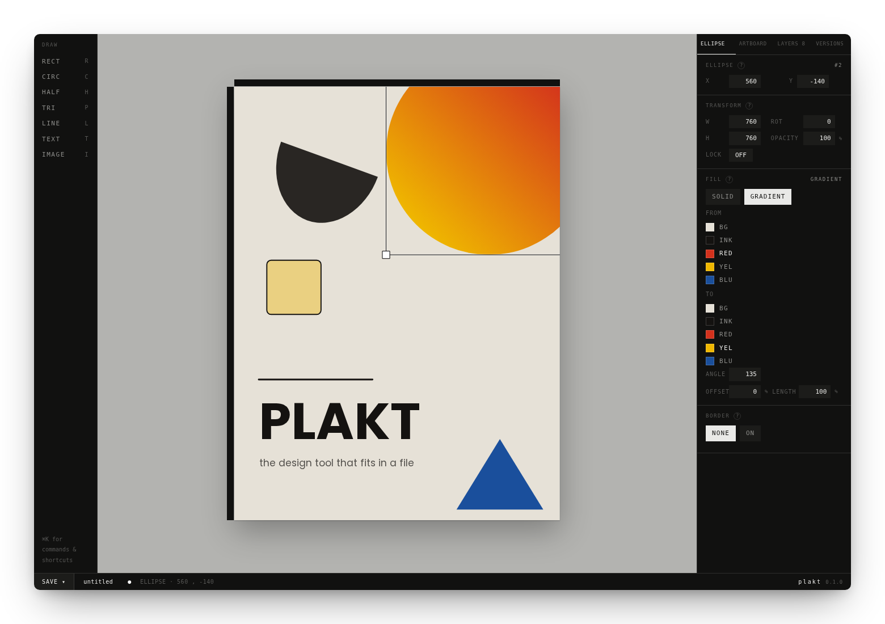

# Plakt

 

Plakt is a graphic design tool that lives entirely inside a single HTML file. There is nothing to install and nothing to build. Plakt has no server, no account, and no network requirement beyond optionally pulling in a Google Font.

> Plakt is a work in progress. Consider the format stable enough to design with, but expect the feature set to keep growing.

_Feel free to [open an issue](https://github.com/emprcl/plakt/issues/new)._



## Getting started

Try it straight away at [empr.cl/plakt](https://empr.cl/plakt/), or grab `plakt.html` from the [latest release](https://github.com/emprcl/plakt/releases/latest) and open it in a modern browser. Press `E`, or double click the canvas, to enter edit mode, then start drawing.

Everything you make lives inside `doc`, the document object embedded in the page itself. Saving writes that object straight back into the HTML, so the file you opened and the file you save are the same file, just updated.

## Saving and opening files

The first time you save a new document, your browser asks where to put it. From then on, saving writes to that same file directly, with no dialog at all.

If you already have a plakt file and want to keep editing it in place, use Open (`Cmd O` or `Ctrl O`, also listed in the command palette) to pick it. Plakt loads its contents and remembers the file, so every save after that goes straight back into it.

Browsers without the File System Access API (Firefox and Safari, at the time of writing) fall back to a regular download on every save.

## Keyboard shortcuts

Press `Cmd K` (or `Ctrl K`) at any time to open the command palette. It lists every action below, searchable by name, and is the fastest way to find something you half remember.

**Drawing**

 - `R` rectangle
 - `C` circle
 - `H` half circle
 - `P` triangle
 - `L` line
 - `T` text
 - `I` image

**Selection and editing**

 - `Cmd D` duplicate
 - `Cmd G` group, `Cmd Shift G` ungroup
 - `Cmd C` copy, `Cmd X` cut, `Cmd V` paste
 - `Backspace` delete
 - `Shift R` rotate 90°
 - `[` send backward, `]` bring forward
 - `Shift` click to multi select, or drag a marquee to select several shapes at once
 - `Option` or `Ctrl` while dragging to bypass snapping

**Document**

 - `Cmd Z` undo, `Cmd Shift Z` redo
 - `Cmd S` save, `Cmd O` open
 - `Cmd 0` reset zoom and pan
 - `G` toggle the grid
 - `E` enter edit mode, `Esc` leave it

## Testing

Plakt's own file has no build step and no dependencies, but its test suite does. Tests run against the real file in a real browser with Playwright.

```sh
npm install
npm test
```

Use `npm run test:ui` for Playwright's interactive UI while writing new tests.

## Contributing

Contributions are welcome, whether it is a bug report, a feature idea, or a pull request.

1. Start with an issue if you are proposing something new, so we can talk it through first.
2. Keep pull requests small and focused, and add a test for anything that touches behavior.
3. Be kind and patient. We are all here to make something worth using.
